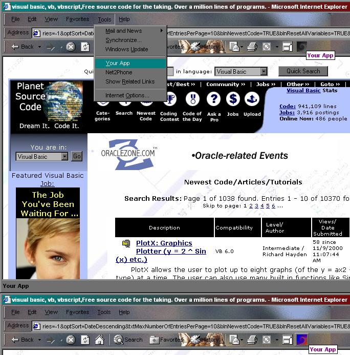



## Add your App to Internet Explorer's Tools Menu and an Icon on the Toolbar \(IE 5\.x\) \(VERSION 2\)

### Description

Add your App to Internet Explorer's Tools Menu and an Icon on the Toolbar (IE 5.x) (VERSION 2). New to Version 2: Overhaul of Program, Access to Add and Delete Functions in a Menu, Mouseover Tips for Menu items, Autocheck for MSIE Path\File & Version, General code cleanup.
 
### More Info
 
Requires MSIE 5.x or higher

             |
---                |---
**Submitted On**   |2000-11-11 16:57:56
**By**             |[Chuck D](https://github.com/Planet-Source-Code/PSCIndex/blob/master/ByAuthor/chuck-d.md)
**Level**          |Advanced
**User Rating**    |4.9 (102 globes from 21 users)
**Compatibility**  |VB 4\.0 \(32\-bit\), VB 5\.0, VB 6\.0
**Category**       |[Internet/ HTML](https://github.com/Planet-Source-Code/PSCIndex/blob/master/ByCategory/internet-html__1-34.md)
**World**          |[Visual Basic](https://github.com/Planet-Source-Code/PSCIndex/blob/master/ByWorld/visual-basic.md)
**Archive File**   |[CODE\_UPLOAD1159411112000\.zip](https://github.com/Planet-Source-Code/chuck-d-add-your-app-to-internet-explorer-s-tools-menu-and-an-icon-on-the-toolbar-ie-5-x-v__1-12718/archive/master.zip)

### API Declarations

Included with Zip

